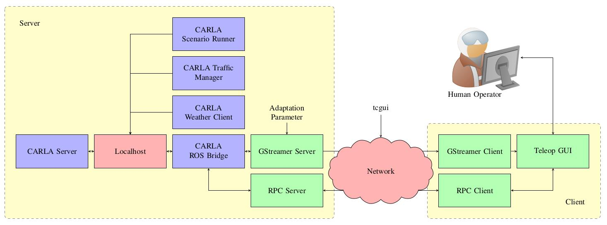

# TELECARLA

[](https://github.com/hofbi/telecarla)
[](https://github.com/hofbi/telecarla)
[](https://results.pre-commit.ci/latest/github/hofbi/telecarla/master)
[](https://github.com/psf/black)

TELECARLA is an extension of the [CARLA simulator](https://carla.org/) for teleoperated driving. We use [GStreamer](https://gstreamer.freedesktop.org/) for compression and transmission of camera data. [ROS](https://www.ros.org/) acts as interface between our framework and CARLA.



> [!IMPORTANT]
> If you have questions, please use the [GitHub Discussions](https://github.com/hofbi/telecarla/discussions) of this repository instead of sending an email.

## Paper

If you use TELECARLA please cite our paper.

*TELECARLA: An Open Source Extension of the CARLA Simulator for Teleoperated Driving Research Using Off-the-Shelf Components, Markus Hofbauer, Christopher B. Kuhn, Goran Petrovic, Eckehard Steinbach; IV 2020* [[PDF](https://www.researchgate.net/publication/341293636_TELECARLA_An_Open_Source_Extension_of_the_CARLA_Simulator_for_Teleoperated_Driving_Research_Using_Off-the-Shelf_Components)]

```tex
@inproceedings{hofbauer_2020,
    title = {TELECARLA: An Open Source Extension of the CARLA Simulator for Teleoperated Driving Research Using Off-the-Shelf Components},
    booktitle = {31st IEEE Intelligent Vehicles Symposium 2020 (IV)},
    publisher = {IEEE},
    address = {Las Vegas, NV, USA},
    author = {Hofbauer, Markus and Kuhn, Christopher B. and Petrovic, Goran and Steinbach, Eckehard},
    month = {Oct},
    year = {2020},
    pages = {1--6},
}
```

## Setup

TELECARLA so far has been tested on

| OS  | ROS Version |
| --- | ----------- |
| Ubuntu 18.04 | Melodic |
| Ubuntu 20.04 | Noetic |

1. Download [CARLA](https://github.com/carla-simulator/carla/releases/latest)
1. Install [ROS](http://wiki.ros.org/ROS/Installation) and [catkin_tools](https://catkin-tools.readthedocs.io/en/latest/installing.html#installing-catkin-tools)
1. Create a workspace with e.g. `mkdir -p ~/catkin_ws_teleop/src && cd ~/catkin_ws_teleop/src`
1. Clone this repository into the workspace's `src` folder with `git clone https://github.com/hofbi/telecarla.git`
1. Run the install script: `./install.sh`
1. Build the workspace: `catkin build`
1. Source your workspace `source ~/catkin_ws_teleop/devel/setup.<your_shell>`

## Run

See the main module for running the application: [telecarla](telecarla/README.md#Run)

## Development

To install the additional tools required for the development, call

```shell
python3 -m pip install -r requirements.txt
sudo apt install -y clang-format clang-tidy-10
sudo snap install shfmt
```

### pre-commit git hooks

We use [pre-commit](https://pre-commit.com/) to manage our git pre-commit hooks.
`pre-commit` is automatically installed from `requirements.txt`.
To set it up, call

```sh
git config --unset-all core.hooksPath  # may fail if you don't have any hooks set, but that's ok
pre-commit install --overwrite
```

#### Usage

With `pre-commit`, you don't use your linters/formatters directly anymore, but through `pre-commit`:

```sh
pre-commit run --file path/to/file1.cpp tools/second_file.py  # run on specific file(s)
pre-commit run --all-files  # run on all files tracked by git
pre-commit run --from-ref origin/master --to-ref HEAD  # run on all files changed on current branch, compared to master
pre-commit run <hook_id> --file <path_to_file>  # run specific hook on specific file
```
