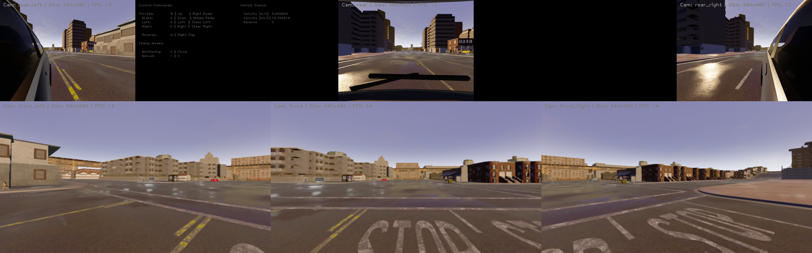

# TELECARLA GUI

The Teleop GUI uses SDL2 to display all camera views, reads input commands from the keyboard and joystick and applies force feedback to the connected joystick.

## Usage

Start the GUI node listening for operator inputs and camera topics with

```shell
roslaunch telecarla_gui telecarla_gui.launch
```

To use the Teleop GUI to a remote server with the CARLA client server connection run

```shell
roslaunch telecarla_gui telecarla_gui_remote_carla.launch carla_host:=IP
```

### Customize Layout

The layout of the GUI is parsed from its layout json config file. The config defines the GUI layout in a matrix structure and supports camera, vehicle status information and static text view. A view element is defined by its type (`camera`, `vehicle_status`, `static_text`), width, height and a key.

The config file [multi_cam_gui_config.json](config/multi_cam_gui_config.json) generated the following layout


