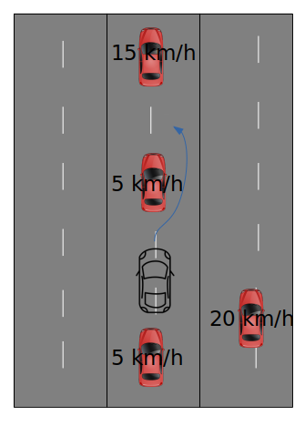
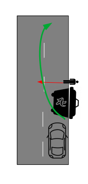
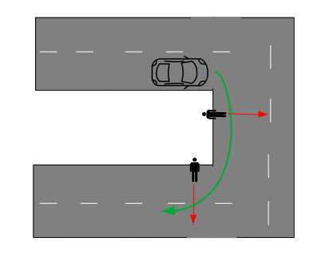
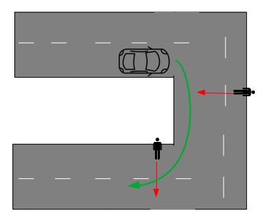
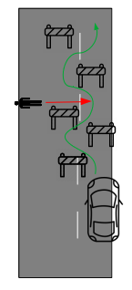

# Scenarios Description

This file presents the scenarios that were created for the use study of the view adaptation. There are in total 5 concepts that have different variations (weather conditions, type of the adversary subject, obstacles...).

## Boxed
This use case presents the traffic jam situation. The Ego vehicle is sandwiched between four cars that have different velocities. The Ego vehicle will have to change lanes in order to overtake the car directly in front. The car on the right lane and the car in front of all the remaining vehicles will change their speed based on the distance of the Ego vehicle to the remaining cars.

## ObstacleAndPedestrian
This use case depicts a container closely followed by a pedestrian who will cross the street when the Ego vehicle approaches. The container has to be safely avoided by the car.

## Pedestrians
This use case tests the direct effect of the view adaptation. When the Ego vehicle turns on its right, it encounters a pedestrian on the right side of the street.

## PedestriansLeftSide
This use case test the performance disadvantage that can be brought by the view adaptation. When the Ego vehicle turns right, a pedestrian or a cyclist cross the street from the left side which is supposed to have a smaller bitrate allocated for the corresponding frame.

## SlalomModified
This use case shares some similarities with **ObstacleAndPedestrian**. It's a simple obstacle avoidance scenario with the addition of a pedestrian. While the driver is focused on avoiding the obstacles, a pedestrian crosses the street from the side opposite to the car's turn orientation.

